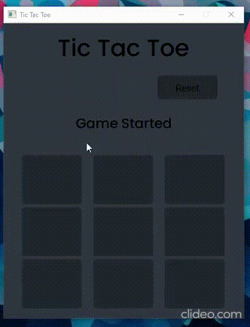

# Tic-Tac-Toe
## A Tic Tac Toe game made with a professional UI

Hello, My name is Abdella Solomon, This is a Tic Tac Toe game made by me. It is made with PyQt5.

The bot plays well in terms of defensing. Try it and let me know if you win the bot.

What are you waiting for?
Clone the code and start enjoying
Have a nice time

# Demo Video
 

# How to get started with it?
```
First open terminal and type:
pip install -r requirements.txt

Second:
  #If you need the single player option:
   python singleplayer.py
  #If you need the multiplayer option:
   python multiplayer.py
```
## Done!!
